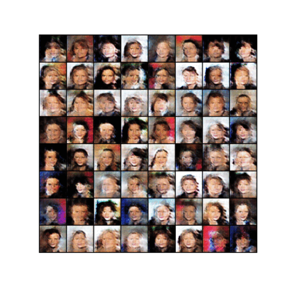
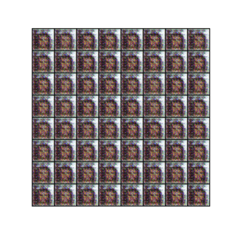
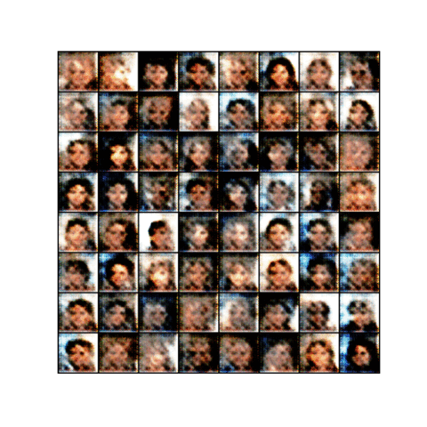
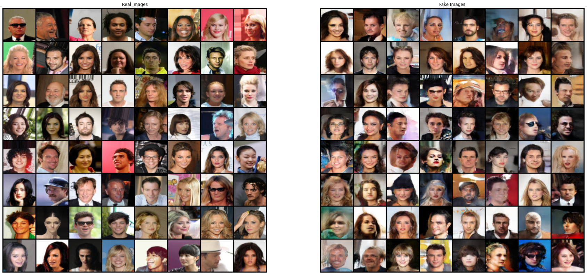

# Vision and Perception project
Project for the course Vision and Perception 2022 edition, Sapienza University of Rome. 

## 📜Short Description
The goal of my project is to create realistic celebrity images using GANs. I used three GANs [DC Gan](https://arxiv.org/pdf/1511.06434.pdf), [Least Square GAN](https://arxiv.org/pdf/1611.04076.pdf) and [Relativistic GAN](https://arxiv.org/pdf/1807.00734.pdf). In order to understand their behavior under different condition, I performed training for 15 epochs and fixing batch size to 128.  
In addition to that, I used three different optimizers [SGD](https://arxiv.org/pdf/1609.04747.pdf), [Adam](https://arxiv.org/pdf/1412.6980.pdf) and [AdaBound](https://arxiv.org/abs/1902.09843) with three different values for learning rate (0.01, 0.004, 0.0003).

### Dataset
⚠️ The [pytorch dataset](https://pytorch.org/vision/stable/generated/torchvision.datasets.CelebA.html#torchvision.datasets.CelebA) has a bug ⚠️:  
`BadZipFile: File is not a zip file`  
I find another way to upload the images doing this:
1. Copy in my Drive the repository from the [official site](http://mmlab.ie.cuhk.edu.hk/projects/CelebA.html);
2. Accessing every time the file on drive would be very slow, so I create a directory in the current colab session and unzip the file there;
3. Using ImageFolder upload the images inside the Dataloader.  
It contains 202.600 images. 
The whole process takes around 1 minute.

### DCGAN
Using a latent vector of 128, the generator and the discriminator have respectively **3.806.080** and **2.766.529** parameters. The generator is made by **Conv2DTranspose**, **BatchNorm2D** and **ReLu** with **TanH** as the last layer. The discriminator is made using **Conv2D**, **BatchNorm2D** and **LeakyReLU**. *BCELoss* is used.  Here is shown the progression of the GAN with *Adam* optimizer, using *0.0003* for the value of the learning rate.

### Least Square GAN
Using the same generator architecture, I hide the last layer of the discriminator (**no Sigmoid**): it may lead to the vanishing gradients problem during the learning process. Here I used the *MSELoss*. The computational time is around 1h and 20 minutes. 
Here is shown the progression of the GAN with *Adam* optimizer, using *0.0003* for the value of the learning rate.

### Relativistic GAN
Using the same generator architecture, I hide the last layer of the discriminator (**no Sigmoid**): instead of using it, it will be used a *BCEWithLogitsLoss* because this version is more numerically stable. In addition to that, a relativistic discriminator is used which compute the probability that the given real image is more "realistic" than a randomly sampled fake image.  
Here is shown the progression of the GAN with *SGD* optimizer, using *0.004* for the value of the learning rate.

### Extensions
Using the best result for each model, I perform more training for 30 epochs using pre-training weights (coming from the previous part). Here is shown the comparison between a real batch of images and a generated one, using *Adam* as optimizer. 

## 📝Info:
For any doubt or clarification send me an [email](mailto:betello.1835108@studenti.uniroma1.it?subject=[GitHub_LTW]). 
**Further note**: the above material is for an univerisity project. More details can be found in the .ipynb file and the power point presentation.
